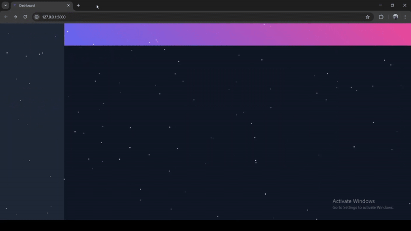
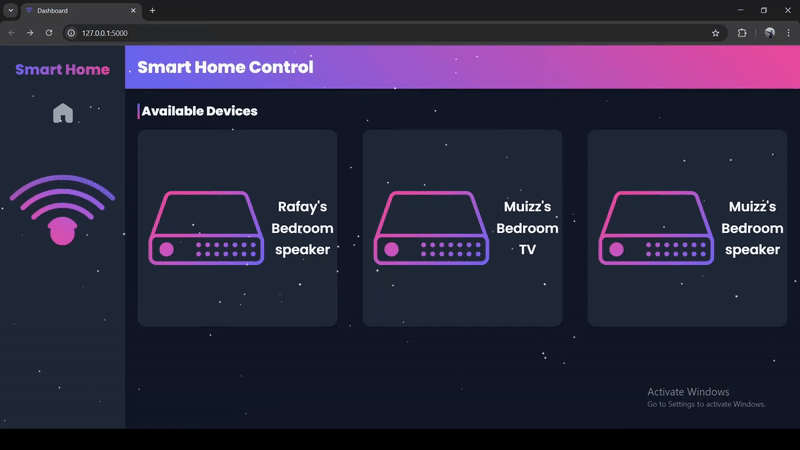
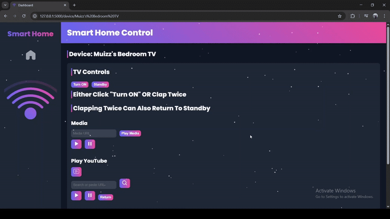

# H-Sync (Control Center for Smart Devices)

## Overview

This is my **Project**, a modular, real‑time control center for all networked smart devices. With zero‑config discovery and a unified web UI, you can:

- **Auto‑Discover Devices**  
   Seamlessly find Chromecasts, Android TVs, Google speakers via mDNS.

- **Unified Controls**  
   Manage power, volume, media playback, control YouTube and launch other apps (Netflix, Spotify) from one interface.

- **Hands‑Free Activation**  
   Toggle devices with a double‑clap gesture (no remote required).

- **Real‑Time Updates**  
   Instant status and event streaming powered by Server‑Sent Events (SSE).

- **Plugin‑Driven Extensibility**  
   Drop in new device support by adding their respective files containing the code.

- **Internet Radio Casting**  
   One‑click streaming of pre-configured radio stations to any Cast device.
---


## Table of Contents
1. [Overview](#overview)
2. [Features](#features)
3. [Screenshots](#screenshots)    
4. [Project Structure](#project-structure)  
5. [High‑Level Architecture (Flow of Requests)](#high‑level-architecture-flow)
6. [Prerequisites](#prerequisites)  
7. [Setup & Installation](#setup--installation)
8. [Permissions](#permissions)  
9. [Firewall Configuration](#firewall-configuration-current-setup-only-requires-mdns)    
10. [Plugin Architecture](#plugin-architecture)
11. [Custom Styling](#custom-styling)
12. [Testing](#testing)
13. [Technologies Used](#technologies-used)
14. [Notes](#notes)      

---


## Features

### General
- **Modular plugin architecture**: Easily extend support for new devices.
- **Central dashboard UI**: Control all devices from one interface, built with Flask and Jinja2.   
- **Real-Time Events**: Server-Sent Events (SSE) stream clap triggers and status changes.  
- **Responsive Design**: Custom CSS, Canvas animations, and Lottie icons.

### Chromecasts and Android T.Vs
- **Discovery**: Auto-detect devices via mDNS (`pychromecast`).  
- **Power Controls (API Doesn't work on Android T.Vs unless already on)**: `turn_on`, `standby`, `toggle` modes.   
- **App Launch**: YouTube, Netflix, Spotify controllers.
- **Media Controls**: Play media URLs
- **Playback Commands**: `play`, `pause`, `seek`.
- **Youtube Controls**: Play YouTube videos (URL or search), `play`, `pause`, `return`
- **Volume controls**: Set volume level, mute/unmute, increase/decrease volume.

#### Clap Detection
- **Clap-to-Power**: Double-clap detection using `sounddevice` near the microphone to turn on a T.V.  
- **Threshold & Decay**: Configurable volume thresholds to reduce false positives.  
- **Graceful Fallback**: Disables feature if microphone or `sounddevice` is unavailable.


### Google Smart Speakers
- **Playback Commands**: `play`, `pause`
- **Volume controls**: Set volume level, mute/unmute, increase/decrease volume.
#### Internet Radio
- **Preconfigured Stations**: Defined in `static/radio_stations.json`.  
- **One-click casting**: Send radio streams to Google speakers.
- **Dynamic Notifications**: Pop-up alerts on successful cast.

### Animated UI
- Particle background effect using `<canvas>`.
- Lottie and Lordicon animations for icons.
- Responsive design with Poppins font, custom CSS theming.

---


## Screenshots

| Dashboard Loading | Dashboard Interactive UI |
| :----------: | :-------: |
|  |  |

| T.V Control UI | Double Clap Detection |
| :----------: | :-------: |
|  |  |

| Speakers Control UI | Internet Radio |
| :----------: | :-------: |
|  |  |

---


## Project Structure

```bash
project/
├── app.py                       # Flask application entrypoint
├── requirements.txt             # Python dependencies
├── core/
│   ├── device_manager.py        # Plugin loader and registry
│   └── protocols.py             # Abstract Device interface
├── plugins/
│   └── chromecast/
│       └── chromecast_driver.py # Chromecast plugin implementation
├── audio/
│   └── clap_listener.py         # Double-clap detection
├── templates/                   # Jinja2 HTML templates
│   ├── layout.html
│   ├── index.html
│   ├── device.html
│   └── speakers.html
├── static/                      # Static assets
│   ├── styles.css
│   ├── scripts.js
│   ├── animations/
│   ├── radio_stations.json
│   └── wifi-tab-icon.svg
└── tests/
    └── test.py                  # Zeroconf discovery tests
```

---


## High‑Level Architecture (Flow)

1. **Web Client ↔ Browser**  
   - Users access the dashboard via any modern browser.  
   - Real‑time updates handled over Server‑Sent Events (SSE) channels.

2. **Flask HTTP Layer**  
   - **`app.py` routes:**  
     - `GET /` → Main dashboard  
     - `GET /device/<name>` → Detail view for a specific device  
     - `POST /api/device/<name>/action` → Control endpoints (e.g. on/off)  
     - `GET /device/<name>/events` → SSE stream for status & clap events  

3. **Plugin Engine & Device Manager**  
   - **`DeviceManager`**  
     - Auto‑discovers and loads every plugin under `plugins/`  
     - Maintains an in‑memory registry of all available devices  
   - **Plugin Drivers**  
     - Each plugin subclasses the `Device` interface (`core/protocols.py`)  
     - Implements core methods: `discover()`, `turn_on()`, `turn_off()`, `get_status()`  
     - May provide optional hooks (`configure()`, `set_brightness()`, etc.)

4. **Domain Layer**  
   - Orchestrates device workflows: discovery, state changes, status polling  
   - Validates inputs, handles retries/timeouts, logs errors

5. **Clap Detection Service**  
   - **`ClapDetector`**  
     - Runs continuously in a background thread or process  
     - Listens on the system microphone  
     - Applies audio‑pattern matching to detect single/double claps  
     - Emits high‑level “clap” events to the Domain Logic Layer
     - Stops if user returns to main dashboard

6. **Event Streaming (SSE)**  
   - Pushes device status updates and clap triggers to connected clients  
   - Enables live UI refresh without polling

7. **Presentation Layer**  
   - **Jinja2 Templates**  
     - Renders dynamic views for device lists, controls, and logs  
     - Injects initial state and SSE endpoint URLs  
   - **Static Assets**  
     - JavaScript handles user interactions, SSE subscription, and UI updates  
     - CSS provides responsive

> **Flow Summary:**  
> Browser ↔ Flask routes ↔ DeviceManager & Plugins ↔ Hardware & ClapDetector → SSE → Browser
---


## Prerequisites

Before installing Python dependencies, install PortAudio:

```bash
sudo apt-get update
sudo apt-get install portaudio19-dev libportaudio2 libportaudiocpp0
```
**why:** Clap detection might not work without it.

---


## Setup & Installation

1. **Clone the repository** 

   ```bash
   git clone https://github.com/code50/191773588/tree/main/cs50x/project
   cd project
   ```

2. **Create a virtual environment (optional)**  
   ```bash
   python -m venv venv
   source venv/bin/activate  # Windows: venv\Scripts\activate
   ```

3. **Install dependencies**  
   ```bash
   pip install -r requirements.txt
   ```

4. **Run the application**  
   ```bash
   python app.py
   ```
   Navigate to `http://localhost:5000`.

---


## Permissions

1. **mDNS / Multicast DNS**  
   - **Why:** Enables Chromecast and other Zeroconf devices to be discovered on your LAN.  
   - **What to allow:** UDP traffic on port **5353** (inbound & outbound).  
2. **Microphone Access**  
   - **Why:** Required for clap‑detection to toggle devices via audio input.  
   - **What to allow:** System‑level microphone permission (usually granted on first launch).

---


## Firewall Configuration (current setup only requires mDNS)

chromecas_driver.py has a function `discovery` that uses mDNS over UDP port 5353 so make sure both inbound and outbound traffic on UDP/5353 is allowed by following the steps below.

### Windows

1. Open **Windows Defender Firewall with Advanced Security** (`Win + R` → `wf.msc`).
2. **Inbound Rule**:
   - **Rule Type:** Port  
   - **Protocol:** UDP  
   - **Port:** 5353  
   - **Action:** Allow the connection  
   - **Profile:** Domain, Private  
   - **Name:** Chromecast mDNS Inbound
3. **Outbound Rule**:
   - Same settings as above  
   - **Name:** Chromecast mDNS Outbound

### Linux & macOS (**Precaution: Haven't been Tested**)

### Linux & macOS

#### Linux (UFW)
```bash
# Allow inbound
sudo ufw allow in proto udp to any port 5353

# Allow outbound
sudo ufw allow out proto udp to any port 5353
```

#### Linux (iptables)
```bash
# Allow inbound
sudo iptables -A INPUT  -p udp --dport 5353 -j ACCEPT

# Allow outbound
sudo iptables -A OUTPUT -p udp --dport 5353 -j ACCEPT
```

#### macOS (pf)
1. Edit (or create) `/etc/pf.conf` and add:
   ```
   pass in  proto udp from any to any port 5353
   pass out proto udp from any to any port 5353
   ```

2. Load and enable the rules:
   ```bash
   sudo pfctl -f /etc/pf.conf
   sudo pfctl -e
   ```
With these rules in place on your platform of choice, Chromecast mDNS packets on UDP/5353 will be both sent and received successfully.

---


## Plugin Architecture

The system follows a **drop‑in plugin** model. By dropping a directory into the **plugin** folder and making a new webpage for the new device, the device should be set up ready for use.

Extend the number/types of devices by dropping new plugins into the `plugins/` folder:

1. **Create**  
   - Make a new subdirectory:  
     ```text
     plugins/<your_plugin_name>/
     ```
2. **Implement**  
   - Inside that folder, add `<your_plugin_name>_driver.py`.  
   - In it, subclass the `Device` base class from `core/protocols.py`:
     ```python
     from core.protocols import Device

     class my_plugin(Device):
         def __init__(self, config):
             super().__init__(config)
             # your init logic

         def discover(self):
             # must return a list of device identifiers
             ...

         def turn_on(self, device_id):
             ...

         def turn_off(self, device_id):
             ...

         def get_status(self, device_id):
             # must return e.g. 'on' or 'off'
             ...
     ```
3. **Validate**  
   - Every driver **must** implement:
     - `discover()`
     - `turn_on(device_id)`
     - `turn_off(device_id)`
     - `get_status(device_id)`  
   - **Optional** features (e.g. `play_media()`, `volume()`, etc.) can be added as needed to the newly created subdirectory in plugins

Once these steps are complete and the webpage made, your new device family will be auto‑discovered and controllable via the REST API.

---


## Custom Styling

The primary CSS file (`static/styles.css`) provides:

- **Dark‑Mode Theme**  
   – Centralized via CSS variables (`:root`) for background, surface, text, primary/accent colors, spacing, and border‑radius.  
- **Google Fonts**  
   – Imports “Poppins” for clean, modern typography.  
- **Link Hover Effects**  
   – Gradient underline that animates on hover, using `linear-gradient` and `transform`.  
- **Layout Grid**  
   – Two‑column layout (`.app-container`): fixed sidebar + flexible main area.  
- **Sidebar Styling**  
   – Gradient‑clipped text logo, padded nav links with hover background fade, and responsive collapse.  
- **Header & Section Accents**  
   – Diagonal gradient on `.main-header` with shadow, plus colored bar accents on `<h2>` headings.  
- **Component Cards**  
   – Device‑list grid cards and control panels with drop shadows, rounded corners, and lift‑on‑hover transforms.  
- **Interactive Elements**  
   – Buttons and inputs styled with gradients, smooth transitions, and hover/active feedback.      
- **Transitions & Simple Animations**  
   – Subtle `transition` rules on page loads/reloads , links, cards, and buttons for a polished feel.

In addition to this animated icons on links and certain buttons are present for visual enhancements.

---

## Testing

Run:
```bash
python tests/test.py
```
To **Diagnose** and/or **Validate** service discovery issues (e.g., mDNS blocked).

---


## Technologies Used

- **Language & Frameworks**  
   - Python 3.8+  
   - Flask (web framework)  
   - Jinja2 (templating)

- **Chromecast & Network**  
   - pychromecast & CastBrowser (mDNS Service discovery & control)  
   - zeroconf (underlying mDNS library)

- **YouTube Integration**  
   - yt-dlp (YouTube search & URL extraction)

- **Audio / Clap Detection** 
   - sounddevice & NumPy (double‑clap detection)  
   - ClapDetector (custom module using pydub & numpy)

- **Frontend**  
   - HTML5, CSS3  
   - Vanilla JavaScript (ES6+)
   - Lottie‑web & Lordicon (vector animations & icons)  
   - AOS (Animate On Scroll) for UI animations    
   - EventSource / Server‑Sent Events (device status updates)

- **HTTP & APIs**  
   - Requests (HTTP library for external API calls)

- **Python Standard Library**  
   - pathlib, importib, logging, threading, queue, json

- **IDE**  
  - VSCode
---


## Notes

- VSCode’s built‑in JavaScript validation will flag errors in our HTML templates (e.g. `device.html`, `speakers.html`) that are actually false positives. **Do not** attempt to “fix” them as enforcing VSCode’s suggestions breaks the backend logic for storing device names.

- Insure a stable internet connection, otherwise some or all devices might not become available on the dashboard.

- If all or certain devices are not shown on the dashboard, simply refresh your page. In the events that refreshing doesn't work either then restart flask in your terminal. 

- Ensure that this program and all your smart devices are connected on the same local network.

- Ideally run this program on-premise.

---